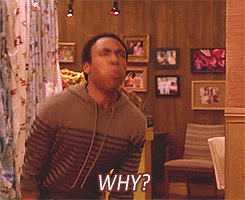

title: "Elm: Zen and the Art of UI Programming"
author:
  name: Phil
  twitter: phil_wade
  url: philwade.org
output: index.html
controls: true

--

# Elm 🌳
### Zen and the Art of UI Programming

--

### Ok, so what is Elm?

* Web development framework
* Compiles to javascript
* Pure, Functional, Strongly typed
* Still in beta, used in production

--

### Why do you care?

--

## It's fast

--

### No Errors

* Strong typing
* Helpful compiler
* Truly semantic versioning

--

### It's fun!

--

### For certain definitions of "Fun"
* You like writing in a functional style
* You are into shared state containers
* Refactoring rules
* Insight into modern web patterns

--

### Basics

--

### Basic Values & Structures

    word : String
	word = "hello pizza"

	count : number
	count = 42

	items : List String
	items = ["car", "boat", "horse"]

	coords : (Int, Int)
	coords = (10, 15)

	type alias Coordinates = { x : Int, y : Int }
	betterCoords : Coordinates
	betterCoords = { x = 10, y = 15 }

	moreCoords = Coordinates 10 15

	updatedCoords = { betterCoords | x = 15 }

--

### Functions

	add : Int -> Int -> Int
	add a b = a + b

	addResults : (Int -> Int -> Int) -> Int -> Int -> Int
	addResults todo a b = (add a b) + (add a b)

--
### Flow control
    if number > 0 then "positive" else "negative or zero"

	case name of
		"Jerry" -> "Seinfeld"
		"Joey" -> "Friends"
		_ -> "I don't know"
--
### Deconstruction and pattern matching

	pair : (Boolean, Boolean)
	pair = (True, False)

	or : (Boolean, Boolean) -> Boolean
	or pair =
		case pair of
			(True, True) -> True
			(True, _) -> True
			(_, True) -> True
			(_, _) -> False

	person = { name = "Joe", age = 50 }
	isAdult { age } = age > 18

--
### The Elm Architecture
* Single purpose
* Opinionated

--
### Demo time!

--
### Other stuff
- subscriptions
- ports

--
### Examples
- https://learningmusic.ableton.com
- https://github.com/rtfeldman/elm-spa-example
